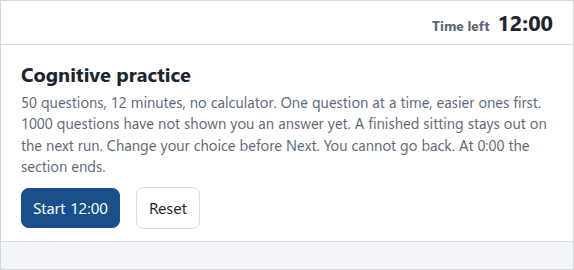
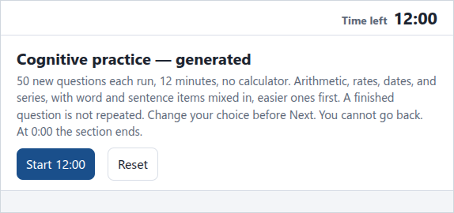
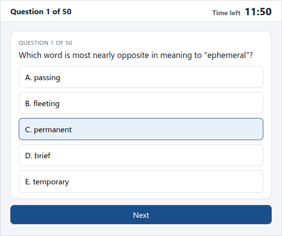
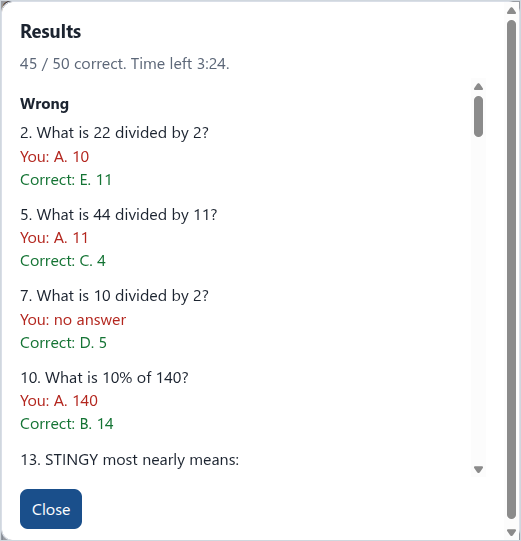
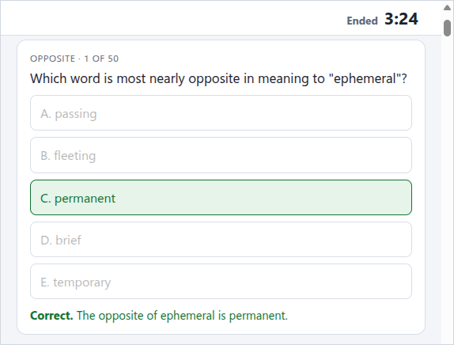

# Cognitive practice

A timed practice sitting in the browser: 50 questions, 12 minutes, no calculator. One question at a time. Change the choice before Next. You cannot go back. At 0:00 the section ends.

The questions here were written for this repo. They are the same kinds of items (arithmetic, words, series, short logic), not copies of a published test.

## How to practice

Open the site, answer one question at a time, then read the result. Nothing to install.

[Practice online](https://chasanc.github.io/cognitive-practice/)

### Open a file

No server and no install. Open either file directly.

[cognitive-practice.html](cognitive-practice.html) draws 50 questions from the bank of 1,000, easier ones first. A finished sitting is remembered in this browser and stays out of the next run.



[cognitive-generated.html](cognitive-generated.html) builds a fresh 50 on each run and mixes in items from the same bank. A finished question is not repeated.



### Answer one question

Click **Start 12:00**. The clock runs, and the header hides until the section ends. Pick a choice. You can change it until you press Next. On the last question that button says **End the Test**.



### When the section ends

The section ends at 0:00, or when you end the last question. Unanswered items score nothing. The dialog lists each miss beside the correct choice, then the ones you got right.



Close the dialog. Every question stays on the page with the answer marked and a short reason. The clock reads **Ended**, and the score stays next to Reset.



**Reset** deals another 50 from questions that have not shown an answer yet. Reset before the section ends leaves those questions available for the next run. **Practice seen questions again** appears after every question in the bank has been finished. It clears that memory and reshuffles the full bank.

## Benefits

The clock is the practice. Each run is 50 questions and 12 minutes, one at a time. A blank scores nothing, so the work is choosing and moving on.

The questions were written for this repo. The bank can be published and reused.

Each run is a new set. The practice page draws 50 from 1,000, easier ones first, and leaves a finished sitting out of the next run. The generated page builds a fresh 50 and skips a finished question.

When the section ends, the score, each miss, and a short reason are on the same page.

Nothing is installed, and answers stay in this browser.

## Rebuild the bank

```bash
node exam/build_extra.js
```

That rewrites `exam/extra-1000.js`.
